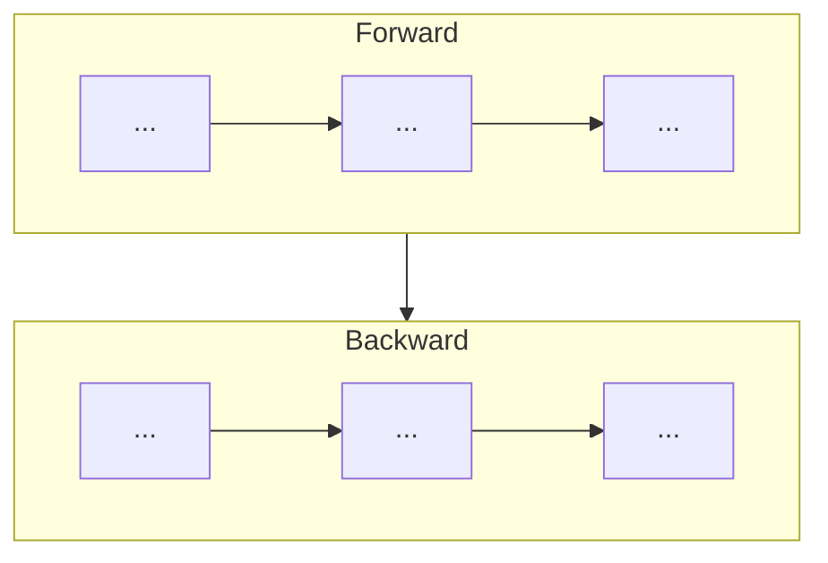

# Mermaid Draw

## Overview

Use this skill to transform a rough Markdown flow description into a concise Mermaid flowchart. Always review the flow structure before drawing: decide which lines should be merged into one node, classify nodes, and polish titles/content for readability.

## Workflow

1. **Read the source Markdown** without overwriting it.
2. **Extract ordered steps** and preserve the user's wording where possible.
3. **Review the flow before drawing:**
   - Decide whether adjacent lines should be merged into one node.
   - Classify each node, usually by labels such as `(通信)` and `(计算)`.
   - Decide whether titles or content need edits for readability.
   - Merge short notes into the nearest relevant node unless the note is an independent decision/state. Render notes with `💡` by default; switch to `🔥` when the note sits on a yellow-background node so it remains visible.
4. **Choose a compact layout:**
   - Use one row only for short flows.
   - For long horizontal flows, split into stage `subgraph`s such as `Forward` and `Backward`.
   - Prefer outer `flowchart TB` with inner `subgraph` blocks using `direction LR` for two-row compact diagrams.
5. **Write new output files** instead of overwriting the user's source Markdown. Use names such as `mermaid_compact.md`, `mermaid_compact.mmd`, or user-requested paths.
6. **Render PNG/SVG** when the user asks for an image, using `scripts/render_mermaid_elk.py` or the repository's existing Mermaid render tool.
7. **Inspect the rendered image** when possible and iterate on layout, wrapping, colors, or labels.

## Review Rules

### Node merging

Merge an operation and its immediate data transformation into one node:

```text
All-Gather (通信)
   [W_shard] ──► [W_full]
```

becomes one Mermaid node:

```mermaid
A["<b>All-Gather (通信)</b><br/><code>W_shard</code> → <code>W_full</code>"]
```

Do not create separate nodes for `W_shard`, `All-Gather`, and `W_full` unless the user explicitly wants a state-machine style diagram.

### Node categories

Use the smallest useful number of categories. For training/system flow diagrams, two categories are often enough:

- `通信`: green
- `计算`: purple

Avoid adding a third color for notes, tensors, or states unless it improves understanding more than it increases visual complexity.

### Titles and content

- Keep the user's title structure, for example `All-Gather (通信)` stays on one line when possible.
- Make node titles bold and larger than body text.
- Use `white-space:nowrap` and `min-width` to avoid awkward title wrapping.
- If a title is still too long, shorten it only after preserving the user's meaning.
- Put detailed transformations or comments in the body line below the title.
- Use `<code>` for technical symbols such as `W_shard`, `W_full`, `G_full`, `G_shard`.
- Remove decorative brackets such as `[]` when they add clutter and the user agrees.
- Prefer a clean internal arrow such as `→` or `⟶` for transformations inside a node.

## Visual Style Defaults

Use these defaults unless the user requests otherwise:

```mermaid
classDef comm fill:#ecfdf5,stroke:#059669,stroke-width:2px,color:#111827;
classDef compute fill:#f5f3ff,stroke:#7c3aed,stroke-width:2px,color:#111827;
```

Use HTML labels for readable node typography:

```mermaid
A["<div style='min-width:250px'><span style='font-size:22px; white-space:nowrap'><b>All-Gather (通信)</b></span><br/><code>W_shard</code> → <code>W_full</code></div>"]
```

For compact two-stage flows:



## Rendering

Render Mermaid with the bundled script:

```bash
python "$SKILL_DIR/scripts/render_mermaid_elk.py" input.mmd --out-dir mermaid_render --stem diagram
```

The script renders both SVG and PNG by default. It uses Mermaid CLI with ELK layout, HTML labels enabled, and CJK-capable font defaults. If the render fails due to missing browser libraries or fonts, install the missing system dependencies if allowed, or report the exact missing dependency and leave the `.mmd`/`.md` files ready.

## References

Read `references/style-guide.md` for detailed style heuristics. Read `references/examples.md` when you need a concrete before/after example.
