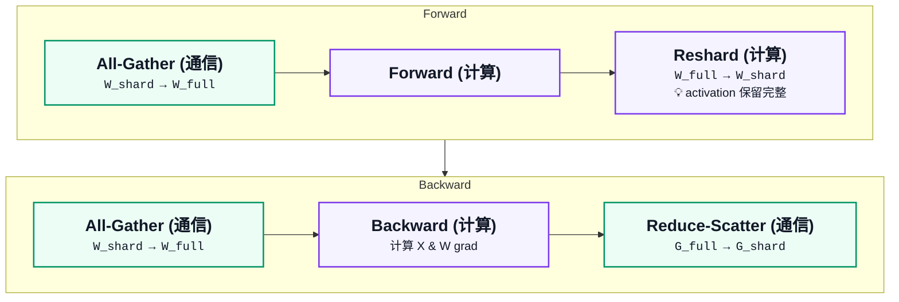

# Example: FSDP flow notes to compact Mermaid

## Input Markdown

```text
All-Gather (通信)
   [W_shard] ──► [W_full]

Forward (计算)

Reshard (计算)
   [W_full] ──► [W_shard]
   💡 activation 保留完整

All-Gather (通信)
   [W_shard] ──► [W_full]

Backward (计算)
    计算 X & W grad

Reduce-Scatter (通信)
   [G_full] ──► [G_shard]
```

## Review

- Merge each operation with its tensor transformation.
- Use two categories: `通信` and `计算`.
- Keep titles as written: `All-Gather (通信)`, `Forward (计算)`, `Reshard (计算)`, `Backward (计算)`, `Reduce-Scatter (通信)`.
- Merge `💡 activation 保留完整` into the `Reshard (计算)` node and render it as `💡 activation 保留完整`.
- Remove `[]` around symbols to reduce clutter.
- Use `<code>` for `W_shard`, `W_full`, `G_full`, `G_shard`.
- Split into `Forward` and `Backward` rows for compact layout.

## Output Mermaid


