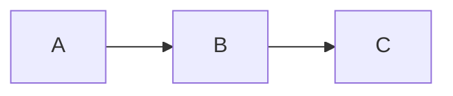
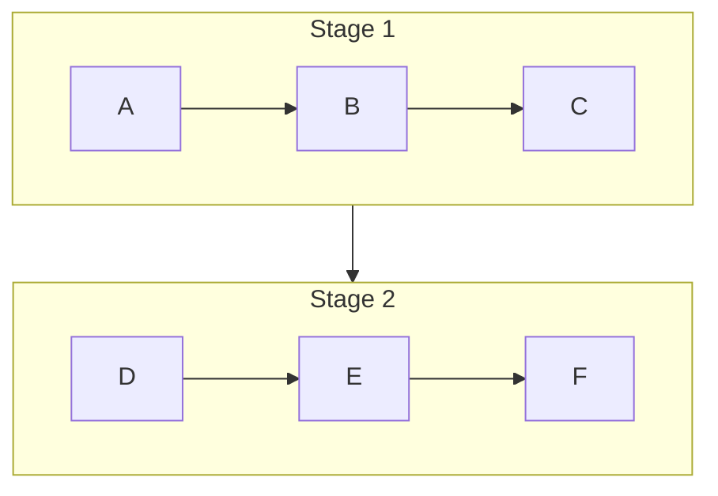

# Mermaid flow drawing style guide

## Pre-draw review checklist

Before writing Mermaid, answer these questions briefly in your own reasoning or in the user-facing plan when review is requested:

1. Which source lines form a single conceptual node?
2. What category does each node belong to?
3. Which labels are titles and which labels are body content?
4. Is any note better merged into a nearby node?
5. Is the flow too long for a single row?
6. Does the output need rendering, and where should generated files go?

## Node merging heuristics

Merge lines when they describe one operation:

- Operation label plus tensor/data transformation.
- Operation label plus one short NOTE.
- Step title plus one short effect/result.

Keep lines separate when they describe different operations, decisions, loops, or independent states.

## Category heuristics

Use explicit markers first:

- `(通信)`, `All-Gather`, `Reduce-Scatter`, `Broadcast`, `All-Reduce` -> `comm`
- `(计算)`, `Forward`, `Backward`, `Reshard`, `Update`, `Compute` -> `compute`

If a node contains mixed labels such as `(计算/分片)`, choose the dominant role based on the operation. For compact two-color diagrams, classify `Reshard` as compute unless the user wants separate communication/state colors.

## Label style

For notes, prefer `💡 note text`. If the note is placed on a yellow-background node, use `🔥 note text` instead for contrast.


Recommended node label pattern:

```mermaid
A["<div style='min-width:250px'><span style='font-size:22px; white-space:nowrap'><b>TITLE</b></span><br/>BODY</div>"]
```

Use `<code>` for exact identifiers:

```mermaid
<code>W_shard</code> → <code>W_full</code>
```

Prefer `→` for compact diagrams. Use `⟶` if the visual should be more prominent and the font renders it well. Avoid long ASCII arrows inside labels if they make the label noisy.

## Layout patterns

### Short flow

Use one horizontal row:



### Long flow

Use two or more stage rows:



This avoids a very wide image while keeping each stage readable.

## Color discipline

Prefer two colors for process diagrams:

```mermaid
classDef comm fill:#ecfdf5,stroke:#059669,stroke-width:2px,color:#111827;
classDef compute fill:#f5f3ff,stroke:#7c3aed,stroke-width:2px,color:#111827;
```

Add more colors only when the user asks for explicit legends or when additional categories are necessary.

## Output rules

- Do not overwrite the source Markdown unless explicitly requested.
- Write Mermaid source to `.mmd` when rendering.
- Write a Markdown wrapper `.md` with a Mermaid code block for convenient viewing.
- Render `.png` and `.svg` when an image is requested.
- Inspect the rendered image when possible and adjust wrapping/layout.
